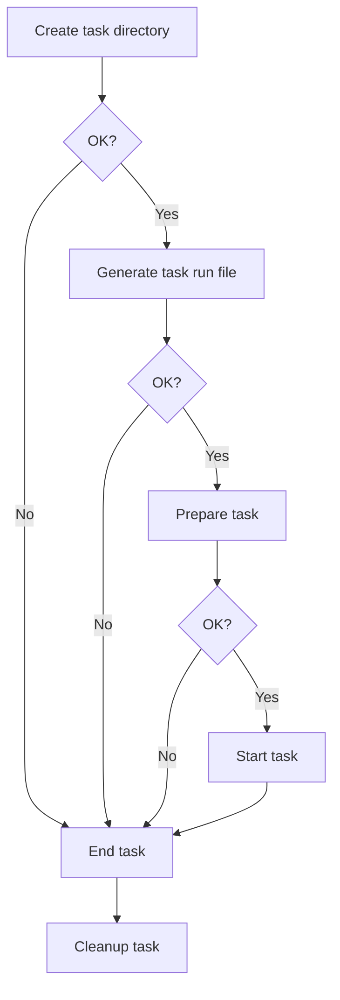

# Task Running Flow

```mermaid
flowchart TD
  create_task_dir[Create task directory]
  task_dir_result{OK?}
  create_file[Generate task run file]
  create_file_result{OK?}
  prepare_task[Prepare task]
  prepare_task_result{OK?}
  start_task[Start task]
  end_task[End task]
  cleanup_task[Cleanup task]

  create_task_dir --> task_dir_result
  task_dir_result -->|Yes| create_file
  task_dir_result -->|No| end_task
  create_file --> create_file_result
  create_file_result -->|Yes| prepare_task
  create_file_result -->|No| end_task
  prepare_task --> prepare_task_result
  prepare_task_result -->|Yes| start_task
  prepare_task_result -->|No| end_task
  start_task --> end_task
  end_task --> cleanup_task
```
